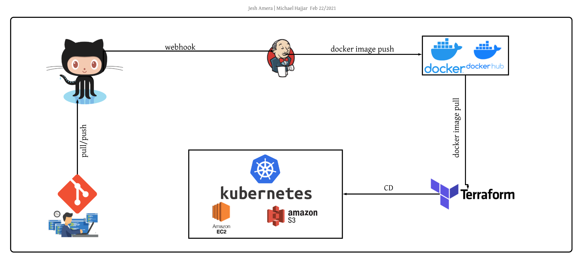
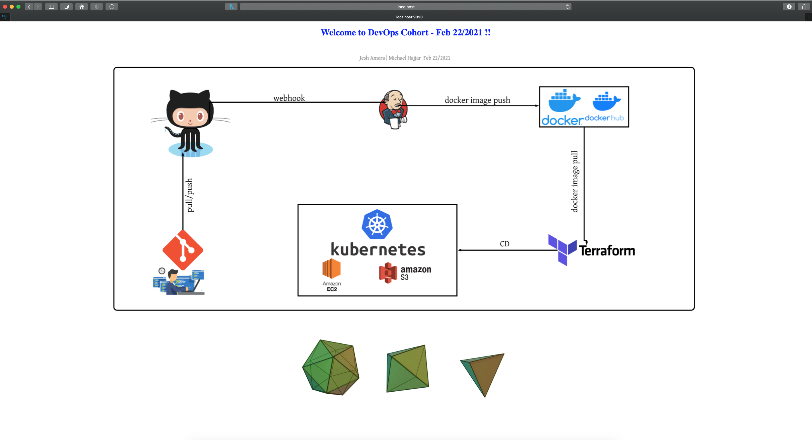

## [Terraform-Kubernetes-Jenkins-Docker-Flask-App-Project](https://github.com/simulationpoint)

* `Install git`

* `Install/start docker`

* `Install/start Jenkins`
 
* `Install kubectl/minikube`

* `Install terraform`

* `Install Kind`

		brew install kind
		
		
* Build the image
		
* Now that we have a Dockerfile. 
		
		docker build -t terraform-flask-app:latest .
		
* After the build completes, we can run the container:
		
		docker run -d -p 8080:8080 -p 5000:5000 terraform-flask-app
		
		docker login --username USERNAME
		
		docker tag my-image USERNAME/my-repo

		docker push USERNAME/my-repo

		
* `touch kind-config.yaml` and put the following config file in it

		kind: Cluster
		apiVersion: kind.x-k8s.io/v1alpha4
		nodes:
		- role: control-plane
		  extraPortMappings:
		  - containerPort: 30201
		    hostPort: 30201
		    listenAddress: "0.0.0.0"

* `curl https://raw.githubusercontent.com/hashicorp/learn-terraform-deploy-nginx-kubernetes-provider/master/kind-config.yaml --output kind-config.yaml`

* `kind get clusters`

* `mkdir learn-terraform-deploy-nginx-kubernetes`
* `cd learn-terraform-deploy-nginx-kubernetes`

		touch kubernetes.tf  add the following config file
		
		
			terraform {
			  required_providers {
			    kubernetes = {
			      source = "hashicorp/kubernetes"
			    }
			  }
			}
			provider "kubernetes" {
			  config_path = "~/.kube/config"
			}		  
		  
* `touch terraform.tfvars/ vim terraform.tfvars`

* `terraform init`

* Add the following to a file `kubernetes.tf`

		resource "kubernetes_services" "flask" {
  metadata {
    name = "flask-app"
  }
  spec {
    selector = {
      App = kubernetes_deployment.flask.spec.0.template.0.metadata[0].labels.App
    }
    port {
      node_port   = 30201
      port        = 9090
      target_port = 9090
    }

    type = "NodePort"
  }
}

resource "kubernetes_deployment" "flask" {
  metadata {
    name = "scalable-flask-app"
    labels = {
      App = "ScalableFlaskApp"
    }
  }

  spec {
    replicas = 2
    selector {
      match_labels = {
        App = "ScalableFlaskApp"
      }
    }
    template {
      metadata {
        labels = {
          App = "ScalableFlaskApp"
        }
      }
      spec {
        container {
          image = "sarankaja/kubesba"
          name  = "flaskApp"

          port {
            container_port = 9090
          }
          resources {
            limits = {
              cpu    = "1"
              memory = "512Mi"
            }
            requests = {
              cpu    = "500m"
              memory = "100Mi"
            }
          }
        }
      }
    }
  }
}
				
* [Use the magic command]() `terraform apply`

* `http://localhost:30201/`

### [Scale the deployment replica = 3]()

* `terraform apply`

* `terraform destroy`
* `kind delete cluster --name terraform-learn`

##### [Wallah! you have successfully deployed your flask app(website) using Terraform, Kubernetes, Jenkins, and Docker!](https://github.com/simulationpoint) 

